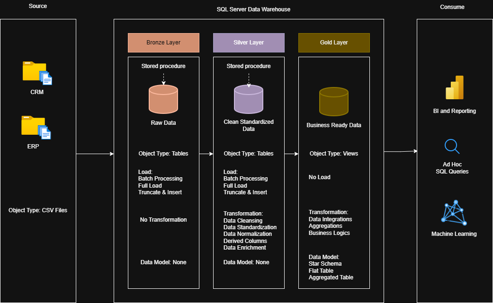

# SQL Data Warehouse

SQL-based data warehouse project built using the Medallion Architecture (Bronze, Silver, and Gold layers). This project demonstrates the complete data warehousing workflow—from ingesting raw data and performing ETL transformations to creating a business-ready dimensional model for analytics.

---

## Project Overview

This project focuses on designing and implementing a scalable data warehouse that transforms raw transactional data into clean, structured, and analysis-ready datasets.

The workflow includes:

- Extracting data from multiple source files
- Cleaning and standardizing data
- Building ETL pipelines using SQL
- Implementing Bronze, Silver, and Gold layers
- Creating a Star Schema for analytical reporting
- Producing business insights through SQL queries

---
## Architecture

The warehouse follows the **Medallion Architecture**.

### Bronze Layer
- Stores raw source data
- Minimal transformations
- Serves as the landing zone for ingestion

### Silver Layer
- Cleans and validates data
- Removes duplicates
- Standardizes formats
- Handles missing and inconsistent values

### Gold Layer
- Business-ready analytical model
- Fact and Dimension tables

---

## Tech Stack

- SQL
- Git & GitHub

---
## Features

- Bronze, Silver, and Gold data layers
- SQL-based ETL pipeline
- Data cleaning and standardization
- Star Schema data model
- Fact & Dimension Tables
- Analytical SQL Views
- Business-ready reporting tables
- Modular SQL scripts
---

## Data Model

The final warehouse uses a **Star Schema** consisting of:

### Fact Tables
- Fact Sales

### Dimension Tables
- Dim Customer
- Dim Product

---

## Business Questions

This warehouse can answer questions such as:

- Which products generate the highest revenue?
- Who are the top-performing customers?
- What are the monthly sales trends?
- Which regions contribute the most sales?
- Which product categories have the highest demand?

---

## Learning Outcomes

- Data Warehousing Concepts
- ETL Pipeline Development
- SQL Data Transformation
- Data Modeling
- Star Schema Design
- Analytical Query Writing

---
